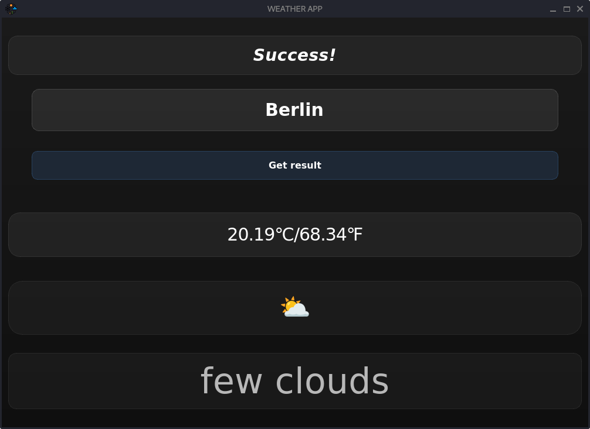
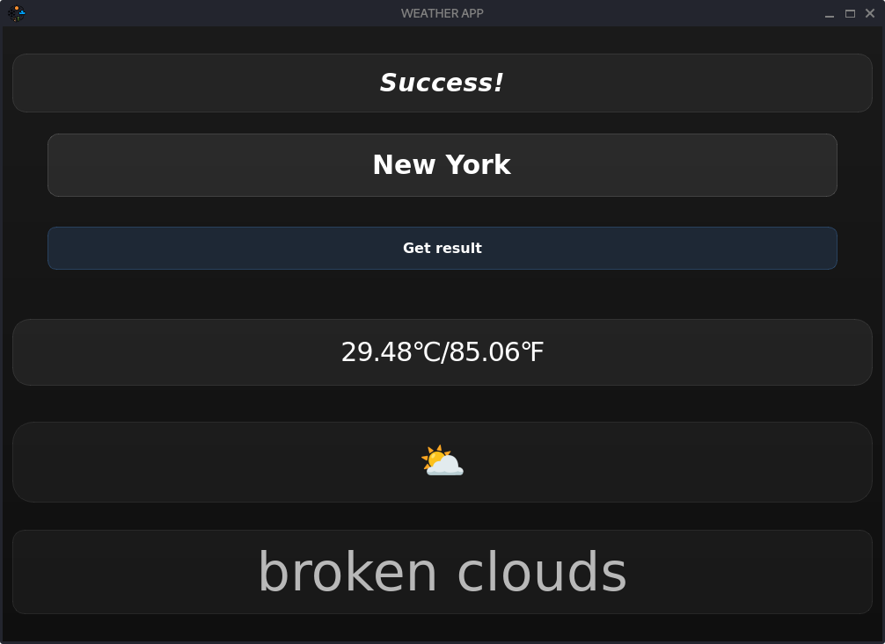

# 🌦️ SkyTune

**SkyTune** is a modern weather app with an aesthetic glassy interface, relaxing background music, and real-time weather data. It uses emoji icons to visually display the weather conditions — making the forecast fun, readable, and chill.

---

## 📸 Screenshots

- 
- 

---

## 🚀 Features

- 🌍 Enter any city and get live weather data.
- 🌡️ Shows temperature in Celsius and Fahrenheit.
- 🌤️ Uses emojis to represent weather conditions.
- 🎵 Background music using `pygame`.
- 💅 Clean, glassmorphic design with blur & shadows.

---

### 🛠️ How to Run the Program
```bash
git clone https://github.com/Holy-Pentagram/ClimaView.git
cd ClimaView
pip install -r requirements.txt
python3 Weather.py
```
(You can copy and paste everything at once or copy paste line by line into the terminal)
